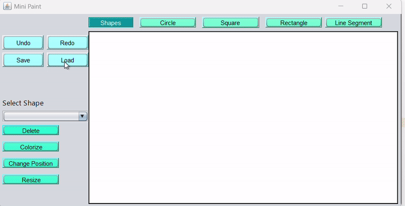
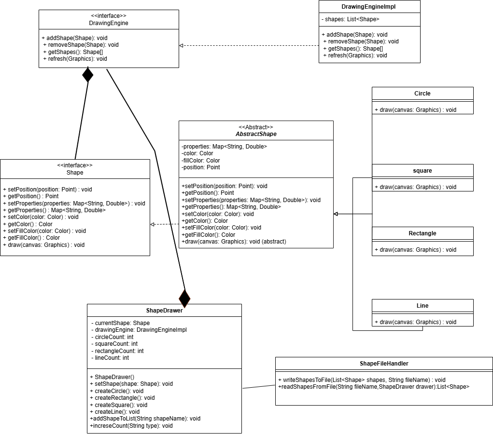

# Mini Paint App

  


**Mini Paint App** is a lightweight desktop application built using **Java** and **Java Swing**. It allows users to create, modify, and manage geometric shapes such as circles, rectangles, squares, and line segments. The app supports features like drawing, coloring, moving, resizing, saving, and loading shapes. This project was developed as part of the **Programming II** course at Alexandria University, Faculty of Engineering.

---

## Table of Contents
1. [Introduction](#introduction)
2. [Features](#features)
3. [Technologies Used](#technologies-used)
4. [Installation](#installation)
5. [Screenshots/GIFs](#screenshotsgifs)
6. [UML Diagram](#uml-diagram)
7. [Usage](#usage)
8. [Example Workflow](#example-workflow) 
9. [License](#license)
10. [Contact](#contact)

---

## Introduction
The **Mini Paint App** is a simplified painting application that allows users to:
- Draw geometric shapes (circles, rectangles, squares, and line segments).
- Colorize and fill shapes.
- Move and resize shapes.
- Save and load shapes to/from a file.
- Manage shapes using a user-friendly GUI.

This project was developed in two phases:
1. **Phase 1**: Basic drawing and shape management .
2. **Phase 2**: Enhanced functionality with moving, resizing, saving, and loading shapes.

---

## Features
### Phase 1 Features:
- **Drawing Tools**: Draw circles, rectangles, squares, and line segments.
- **Color Picker**: Choose colors for shapes and their fill.
- **Shape Management**: Add, remove, and list shapes using a drop-down menu.
- **Undo/Redo**: Easily undo or redo actions.

### Phase 2 Features:
- **Move Shapes**: Move shapes to new positions.
- **Resize Shapes**: Adjust the dimensions of shapes.
- **Save/Load**: Save shapes to a file and load them later.
- **Enhanced GUI**: Intuitive interface for managing shapes and operations.

---

## Technologies Used
- **Java**: Core programming language.
- **Java Swing**: For building the graphical user interface (GUI).
- **Java AWT**: For basic rendering and event handling.
- **Object-Oriented Programming (OOP)**: Inheritance, polymorphism, and encapsulation.
- **UML Diagrams**: For system design and documentation.

---

## Installation
To run the **Mini Paint App** locally, follow these steps:

1. **Clone the repository**:
   ```bash
   git clone https://github.com/your-username/mini-paint-app.git
2. **Navigate to the project directory:**:
   ```bash
   cd mini-paint-app
3. **Compile the project:**
   ```bash
   javac src/*.java
5. **Run the application:**
   ```bash
   java -cp src Main

## Screenshots/GIFs
Here are some screenshots and GIFs demonstrating the functionality of the **Mini Paint App**:

```markdown
<!-- Add your screenshots or GIFs here -->
- **Screenshot 1**: Main application window.
  

- **GIF 1**: Drawing  shapes.
  ![Drawing Shapes]Images/createCir.gif)

- **GIF 2**: Applay features Moving, Colorizing, resizing, and deleting.
  

- **GIF 3**: Save shapes.
  

- **GIF 4**: Load shapes.
  
```

## [UML Diagram
**UML class Digrame**


## Usage
To use the **Mini Paint App**, follow these steps:


1. Launch the application:
   - Run the application using the command:
     ```bash
     java -cp src Main
     ```

2. Drawing a Shape:
   - Click on the desired shape button (Circle, Rectangle, Square, or Line Segment).
   - Enter the required properties (e.g., position, radius, width, height) in the dialog box.
   - The shape will appear on the canvas.

3. Managing Shapes:
   - Use the drop-down menu to select a shape by its unique name (e.g., "Circle01", "Rectangle02").
   - Apply operations like colorize, delete, move, or resize to the selected shape.

4. Moving a Shape:
   - Select the shape from the drop-down menu.
   - Click "Change Position" and enter the new coordinates (x, y).
   - The shape will move to the new position.

5. Resizing a Shape:
   - Select the shape from the drop-down menu.
   - Click "Resize" and enter the new dimensions (e.g., radius, width, height).
   - The shape will resize accordingly.

6. Saving Shapes:
   - Click "Save" to save all shapes to a file.
   - Choose a file location and name (e.g., `shapes.txt`).
   - The shapes will be saved in the specified file.

7. Loading Shapes:
   - Click "Load" to load shapes from a previously saved file.
   - Select the file (e.g., `shapes.txt`).
   - The shapes will be loaded and displayed on the canvas.

8. Undo/Redo:
   - Click "Undo" to revert the last action.
   - Click "Redo" to reapply the last undone action.

1. Draw a Circle:
   - Click the "Circle" button.
   - Enter position (x=100, y=100) and radius (r=50).
   - The circle will appear on the canvas.
## Example Workflow:

2. Move the Circle:
   - Select "Circle01" from the drop-down menu.
   - Click "Change Position" and enter new coordinates (x=200, y=200).
   - The circle will move to the new position.

3. Save Shapes:
   - Click "Save" and choose a file (e.g., `shapes.txt`).
   - All shapes will be saved to the file.

4. Load Shapes:
   - Click "Load" and select the file (e.g., `shapes.txt`).
   - The shapes will be loaded and displayed on the canvas.
  
